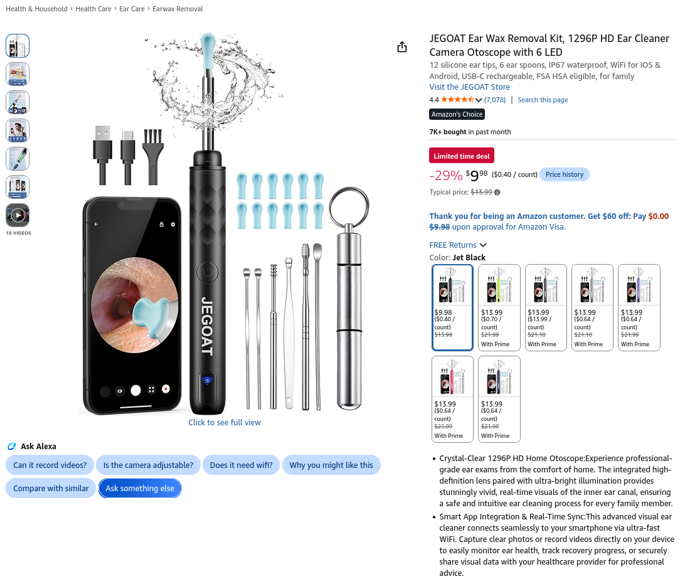
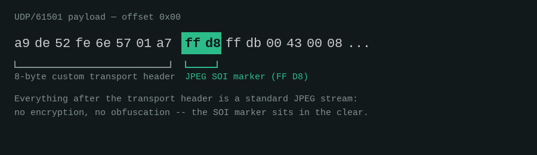
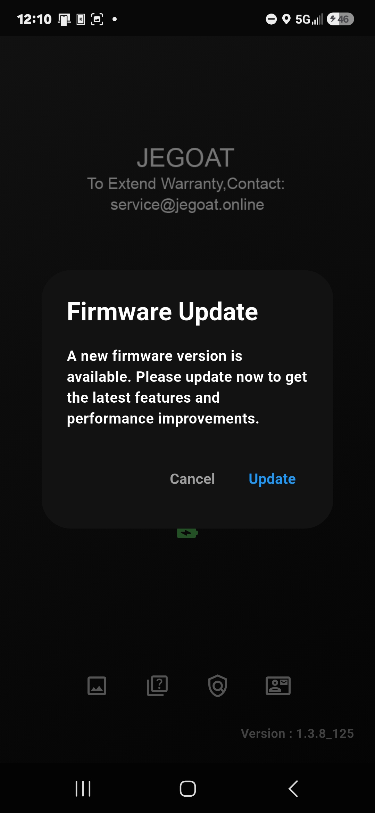

## Security Advisories

CISA: advisory pending publication

> **Note:** CISA has not yet published its CSAF advisory for this
> coordination as of this writing. Once it is live, its advisory ID will
> be added here and everywhere else in this repository that currently
> reads "advisory pending publication."

CVE IDs: CVE-2026-81330, CVE-2026-82563, CVE-2026-81640, CVE-2026-77974

## Overview

The Softish C6 is a consumer ear camera. It is a small otoscope with a camera at
the tip, a Wi-Fi radio in the handle, and an Android app called EarVision
(package `com.atomath.wifi_camera`). You point it into an ear canal and watch the
feed on your phone. The same hardware is sold under several other names,
including the Jegoat branding, which is typical of white-label IoT.



I bought the hardware, pulled the app apart, and put a wireless interface into
monitor mode. What I found was not one flaw. It was the complete absence of a
security model.

Four issues were assigned CVEs, coordinated through CISA:

| CVE            | Issue                                            | CWE      | CVSS 3.1     |
| -------------- | ------------------------------------------------ | -------- | ------------ |
| CVE-2026-81330 | Live video transmitted in cleartext over UDP     | CWE-319  | 6.5 Medium   |
| CVE-2026-82563 | Device identified by broadcast values, not crypto | CWE-290  | 7.6 High     |
| CVE-2026-81640 | AP password derivable from the broadcast BSSID   | CWE-798  | 8.8 High     |
| CVE-2026-77974 | Unauthenticated, unsigned OTA firmware transfer   | CWE-306  | 8.0 High     |

CWEs and CVSS scores above are the official values from the published CVE
records. None of the four reach the Critical band (9.0+) under standard CVSS
v3.1 thresholds, and CVE-2026-81640 — the password-derivation issue — is the
highest-scoring of the four, despite reading as the quieter, enabling step in
the narrative below.

Individually, each is a common IoT mistake. Chained, they let anyone within
radio range watch the video feed, impersonate the camera to the app, and push
unsigned firmware to the hardware.

## At a Glance

- **Affected product:** Softish C6 ear camera and the EarVision Android app
- **Affected version:** EarVision v1.3.1 (versionCode 132)
- **Affected firmware variants:** `bk7252n_251117` (Beken BK7252N), `txw806_111` (TXW806), `txw810_125` (TXW810)
- **Attacker position:** Wireless range of the device or the phone
- **Required interaction:** None for video interception; one tap for the OTA chain
- **Vendor contact:** No vendor security contact could be identified
- **Coordination:** CISA (advisory pending publication)

## Why This Device Is Different

Most IoT camera research ends with "an attacker can watch your living room."
That is bad. This is a different category.

An ear camera points inside a human body. The footage contains ear canal
anatomy, eardrum condition, skin and infection detail, hearing aids and cochlear
hardware, and anything else the user happens to sweep past on the way in. These
devices are marketed to parents for use on children and sold as a way to check
an ear infection at home instead of booking a visit.

So the data on the wire is biometric, medical-adjacent, frequently depicts a
minor, and is being captured by a device whose entire threat model is one
predictable Wi-Fi password.

Nothing in the product treats that data as sensitive.

## How the Device Works

The C6 does not join your home network. It is its own access point. The phone
disconnects from whatever network it was on, associates with the camera's SSID,
and the app talks to the device directly over UDP.

```text
   ┌──────────────┐                        ┌──────────────┐
   │   C6 camera  │   softAP: SSID + WPA2  │  Android     │
   │  (AP + cam)  │◄──────────────────────►│  EarVision   │
   └──────┬───────┘                        └──────┬───────┘
          │                                       │
          │  UDP/61500   control, status, OTA      │
          │──────────────────────────────────────►│
          │  UDP/61501   video frames (JPEG/WEBP)  │
          │──────────────────────────────────────►│
          │                                       │
      no TLS · no auth · no signing · no replay protection
```

Two UDP ports carry everything. Port 61500 is the control and OTA channel. Port
61501 is the video channel. Neither is encrypted, neither is authenticated, and
the app's manifest explicitly opts in to cleartext:

```xml
<application
    android:usesCleartextTraffic="true"
    ... >
```

That flag is the whole design summarized in one attribute. There is no TLS to
disable because there was never any TLS.

## CVE-2026-81330: Cleartext Video Over UDP

Video frames leave the device as ordinary JPEG and WEBP payloads inside UDP
datagrams on port 61501. There is no transport encryption and no
application-layer encryption underneath it.

The consequence is that possession of the Wi-Fi key is the only thing standing
between an observer and the video. Once an attacker has that key, or captures
the handshake and derives it, frames can be pulled straight out of a monitor-mode
capture and reassembled. No pairing, no app, no interaction with the user.

```text
  802.11 monitor capture
        │
        ▼
  decrypt with PSK  ──────►  UDP :61501 datagrams
                                   │
                                   ▼
                          strip transport header
                                   │
                                   ▼
                     JPEG / WEBP frame boundaries
                                   │
                                   ▼
                            reconstructed video
```



In my testing, frame reconstruction quality tracked the quality of the wireless
capture. Packet loss in the capture shows up as lost frames, not as failure. The
attack degrades gracefully, which is the wrong property to have here.

Recovery is passive. The camera has no way to detect it, the app has no way to
detect it, and the user has no indication it is happening.

## CVE-2026-81640: The Access Point Password Is Derivable

The camera's access point uses a per-device password rather than a single
hardcoded one shared across the product line. That sounds like the right call.
It is undermined by how that password is generated.

The password appears to be derived algorithmically from the device's BSSID.

The BSSID is the access point's MAC address. It is transmitted in the clear, in
every single beacon frame, several times per second, to anyone listening. It is
not a secret and was never intended to be one. Deriving a credential from it
means the credential is not a secret either.

```text
   Beacon frame (broadcast, cleartext, ~10x/sec)
   ┌────────────────────────────────────────────┐
   │ SSID: <device name>                        │
   │ BSSID: AA:BB:CC:DD:EE:FF  ◄── public       │
   │ capabilities, rates, ...                   │
   └───────────────────┬────────────────────────┘
                       │
                       ▼
              derivation routine
                       │
                       ▼
              WPA2 pre-shared key  ◄── "secret"
```

The practical effect is that the per-device password provides no meaningful
protection. An attacker in range reads the BSSID off the air, runs the
derivation, and holds the key. No handshake capture, no dictionary, no cracking
time. From there, CVE-2026-81330 follows immediately: they can associate with the
camera or decrypt captured traffic and read the video.

CWE-798 covers hardcoded credentials, and it is the officially assigned
weakness for this CVE. The credential is not literally hardcoded in firmware,
but it is fully determined by a public value, which has the same practical
outcome: a value an attacker never has to guess.

## CVE-2026-82563: The App Does Not Authenticate the Device

EarVision needs to decide whether the thing it is talking to is a real C6. It
appears to make that decision using broadcast identifiers, such as the Wi-Fi
SSID and BLE identity, rather than any cryptographic proof.

There is no device certificate, no challenge-response, no shared secret proved
over the channel, and no signature on device responses. The app trusts an
endpoint because it looks right from the outside.

Everything the app checks is a value an attacker can read off the air and
reproduce. Standing up a rogue access point that presents the expected identity
is enough for the app to accept it as the camera.

```text
   real C6 ──── beacons ────►  attacker observes identity
                                        │
                                        ▼
                              rogue AP mimics identity
                                        │
   EarVision app ──── associates ──────►│
                                        │
                     app accepts it as a genuine device
                     and consumes whatever JSON it returns
```

Once the app accepts the rogue endpoint, the attacker controls both directions of
the conversation. Device status is whatever the attacker says it is. That is the
pivot into the final issue below: unauthenticated, unsigned firmware execution.

## CVE-2026-77974: Unauthenticated, Unsigned Firmware Update

The C6 handles firmware backwards relative to most IoT devices. The firmware
images are not fetched from a vendor server by the device. They are bundled
inside the Android APK, and the phone pushes them to the camera.

Three images ship in the app, one per chipset variant:

```text
  bk7252n_251117   Beken BK7252N
  txw806_111       TXW806
  txw810_125       TXW810
```

The app also bundles an MNN neural network runtime and a TensorFlow Lite model
(`core.db`, 5.2 MB) used for on-device image processing. That model is reachable
through the same update path as the firmware, with the same absence of controls.

The update is triggered entirely by device-reported state. The app polls device
status as JSON. Two fields decide whether an update happens:

```json
{
  "device_version": "111",
  "ota_device_version": "125"
}
```

If `ota_device_version` is greater than `device_version`, the app decides the
device is out of date and shows the user an update prompt. Nothing authenticates
those fields. They arrive over unencrypted UDP from an endpoint the app never
verified.

When the user accepts, the app sends the raw bundled firmware over UDP port
61500 using opcode `10 04`. I observed no authentication on the transfer, no
transport encryption, and no cryptographic signature verification on the image
at any point.

```text
  attacker rogue AP                    EarVision app
        │                                    │
        │  status JSON                       │
        │  device_version:     111           │
        │  ota_device_version: 125  ─────────►
        │                                    │
        │                          "Update available"
        │                                    │
        │                          user taps Accept
        │                                    │
        ◄──── UDP :61500, opcode 10 04 ──────│
              raw firmware image
              unsigned · unauthenticated · cleartext
```

Three separate controls are missing here, and any one of them would have
contained the issue:

1. **Authentication on the status channel.** Version fields are accepted from an
   unverified source: a security-relevant operation is reachable with no
   authentication in front of it. This is CWE-306, the officially assigned
   weakness for this CVE.
2. **Signature verification on the image.** Nothing binds the firmware to the
   vendor, so code is downloaded and used with no integrity check.
3. **Transport security.** The transfer itself is observable and modifiable in
   flight.

The user-facing prompt is the only gate, and it is a poor one. It is the same
prompt a legitimate update produces. The user cannot distinguish them, because
the app cannot distinguish them.



## The Full Chain

The individual issues compose cleanly.

```text
  ┌─ 1 ────────────────────────────────────────────────┐
  │ Read BSSID from beacon frames (public, passive)    │
  └───────────────────────┬────────────────────────────┘
                          ▼
  ┌─ 2 ── CVE-2026-81640 ──────────────────────────────┐
  │ Derive the WPA2 pre-shared key from the BSSID      │
  └───────────────────────┬────────────────────────────┘
                          ▼
         ┌────────────────┴────────────────┐
         ▼                                 ▼
  ┌─ 3a ── CVE-2026-81330 ──┐   ┌─ 3b ── CVE-2026-82563 ─────────┐
  │ Decrypt and reassemble  │   │ Stand up a rogue AP that the    │
  │ the live video stream   │   │ app accepts as the real device  │
  └─────────────────────────┘   └───────────────┬─────────────────┘
                                                ▼
                                ┌─ 4 ── CVE-2026-77974 ──────────┐
                                │ Serve spoofed status JSON,      │
                                │ trigger the OTA prompt, receive │
                                │ or substitute unsigned firmware │
                                └─────────────────────────────────┘
```

Step 3a needs no user interaction at all. Step 4 needs exactly one tap on a
prompt the user has been trained to accept.

## Methodology

All testing was performed against researcher-owned hardware and a
researcher-controlled environment. No third-party device, network, or user was
involved at any point.

**Static analysis.** I decompiled the EarVision APK and reviewed the
`AndroidManifest.xml`, which is where `usesCleartextTraffic="true"` turned up. I
extracted the bundled assets, which is how the three firmware images, the MNN
library, and the `core.db` TFLite model were found. Version handling in the app
led to the `device_version` and `ota_device_version` comparison.

**Wireless capture.** I placed an interface in monitor mode and captured traffic
between the phone and the camera across normal app usage: pairing, live viewing,
capture, and update checks.

**Protocol analysis.** I separated the two UDP channels, identified the control
opcodes on 61500 and the frame transport on 61501, and mapped the JSON status
schema.

**Frame reconstruction.** I rebuilt JPEG and WEBP frames from captured UDP
payloads and confirmed the video was recoverable from passive capture alone.

**Spoofing proof of concept.** I operated a rogue access point presenting the
expected device identity, confirmed the app accepted it, and confirmed that
spoofed version fields produced the OTA prompt and the subsequent firmware
transfer on port 61500.

## Disclosure

I reported the issues to CISA, which coordinated CVE assignment. The four
CVEs were published on 2 September 2026. CISA's advisory was still pending
publication as of this writing; its CSAF identifier will be added here once
it goes live.

I was unable to identify a security contact for the vendor. The product ships
under multiple brand names from what appears to be a white-label manufacturing
arrangement, with no published vulnerability disclosure policy, no
`security.txt`, and no security address on any of the storefronts or
documentation I could locate. This is the normal condition for this class of
hardware and it is the reason coordination went through CISA rather than
direct contact.

This is worth stating plainly rather than burying: the reason a consumer medical
imaging device has no security model is the same reason it has no security
contact. Nobody in the supply chain owns the problem. The OEM builds a reference
design, the brand puts a name on the box, the reseller ships it, and the app is
maintained by whoever wrote it first. There is no one to email.

## For Owners of This Device

If you own a C6 or a rebadged equivalent, the practical guidance is short,
because there is no patch to apply.

- Treat any footage the device captures as though it were broadcast publicly,
  because in effect it is.
- Only power the device on for the duration of an actual use. The access point is
  live whenever the device is on.
- Do not use it in a location where you would not accept a stranger in range
  watching the feed.
- Decline firmware update prompts unless you have a specific reason to believe
  they are genuine. You have no way to verify this, which is itself the point.
- For anything that will inform a medical decision, particularly for a child,
  use a clinician rather than this device.

None of that is satisfying advice. It is what is available when the device has no
mechanism to be fixed in the field.

## For Vendors Building This Class of Device

Every issue here has a well-understood, decades-old solution. None of them are
research problems.

**Encrypt the media channel.** DTLS or SRTP over the existing UDP transport. The
frames are already framed; wrapping them is not a redesign.

**Authenticate the device cryptographically.** Provision a per-device key or
certificate at manufacture and prove possession over the channel. An SSID is an
identifier, not an authenticator. The distinction is the entire issue in
CVE-2026-82563.

**Generate the AP password from real entropy.** A random per-device password
printed on the device or its packaging is both more secure and easier to
implement than a derivation function. If the password must be derived, it cannot
be derived from a value that is broadcast in the clear.

**Sign firmware and verify on the device.** The bootloader verifies a signature
against a key burned into the hardware, and rejects anything that fails. This is
the single control that would have prevented CVE-2026-77974 from mattering,
regardless of everything else being broken.

**Do not trust device-reported state for security decisions.** An unauthenticated
endpoint claiming it needs an update is not evidence that it needs an update.

**Publish a security contact.** A `security.txt` file and a monitored address.
This one costs nothing.

**Apply a higher standard to body-facing imaging.** A device that captures the
inside of a person should not be engineered to the standard of a novelty webcam.
Where a product is marketed for use on children or in a medical context, the data
handling should reflect that, whether or not regulation currently requires it.

## Broader Pattern

Cheap white-label IoT is a large and growing share of the devices in people's
homes, and it is built on reference designs that get copied across product lines
with the security model intact, meaning absent. The chipsets here, Beken and TXW
parts, appear in a wide range of consumer devices. The design patterns I found
are not specific to ear cameras.

What made this case worth publishing is the gap between the sensitivity of the
data and the effort spent protecting it. The product has an on-device neural
network for image processing. Someone spent real engineering time on the imaging
pipeline. The video that pipeline produces goes out over the air in the clear,
protected by a password that is printed in every beacon frame.

That is not a resource problem. It is a priorities problem, and it is the
predictable outcome when nobody in a supply chain is accountable for security and
no regulation forces the question.

## Exploit-Code Policy

I am not publishing the key derivation routine, the rogue AP implementation, or
tooling to reconstruct video from capture files.

The issues are published, the CVEs are assigned, and the affected behavior is
described here in enough detail for defenders, researchers, and anyone in the
supply chain to understand and act on it. There is no patch available, no
automatic update path, and an unknown number of these devices in homes. Shipping
working attack tooling against an unpatchable device in that position would harm
users without meaningfully advancing anyone's understanding.

Researchers who need technical detail for defensive or coordination purposes can
contact me directly at mdubbrin@gmail.com.
